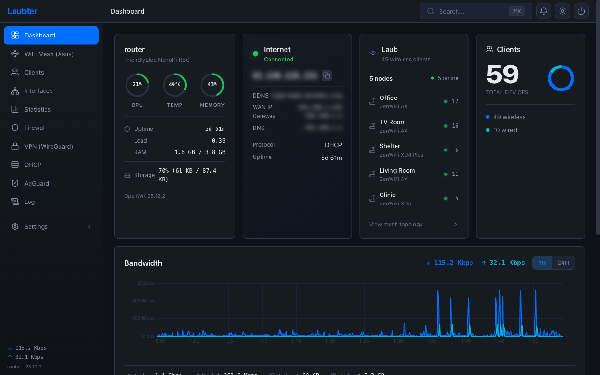
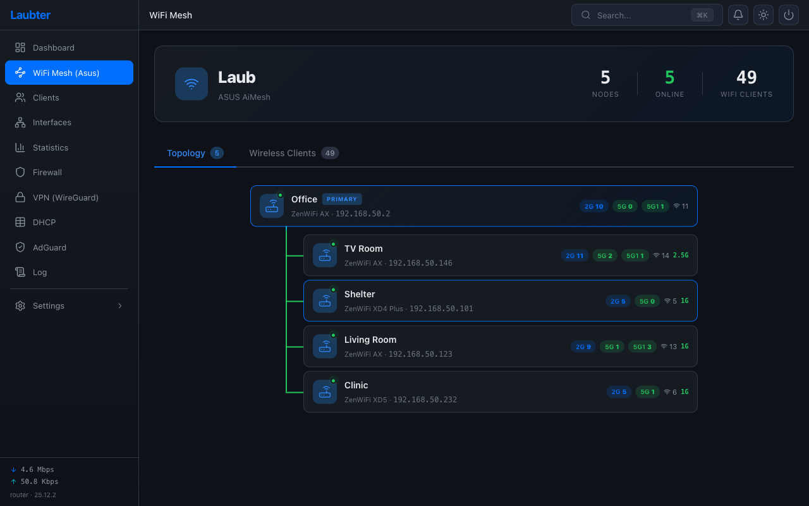
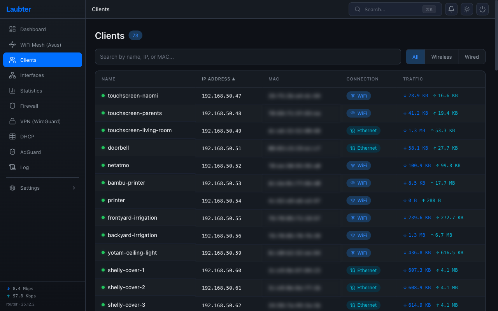
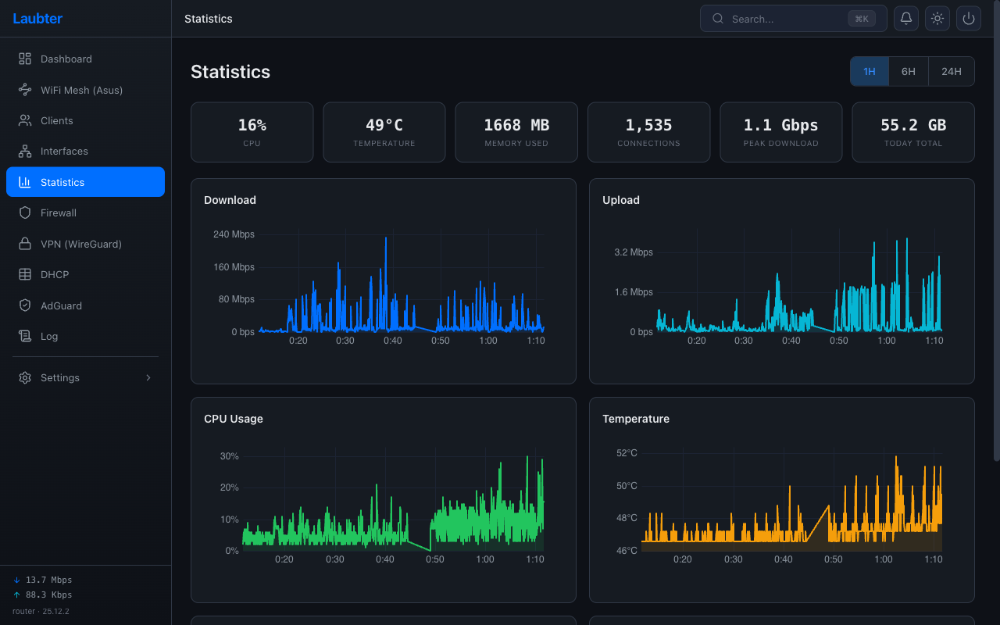
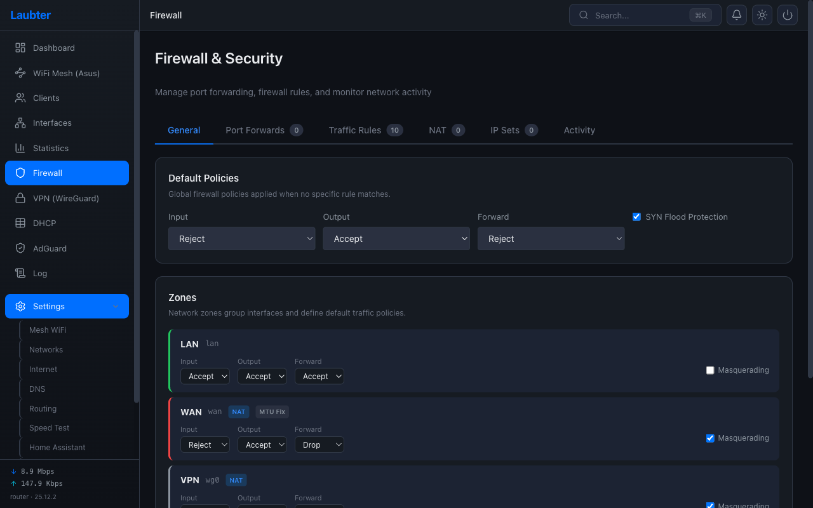
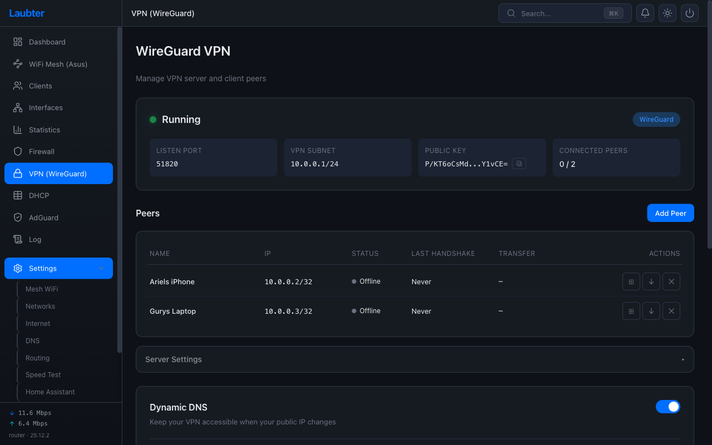
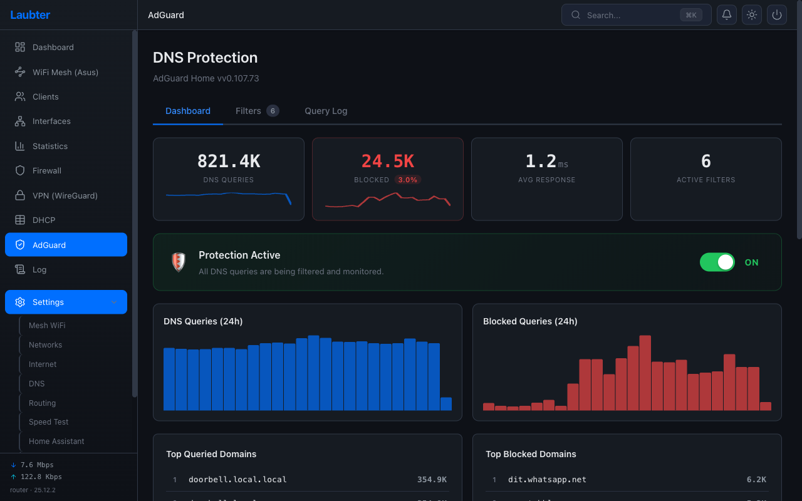
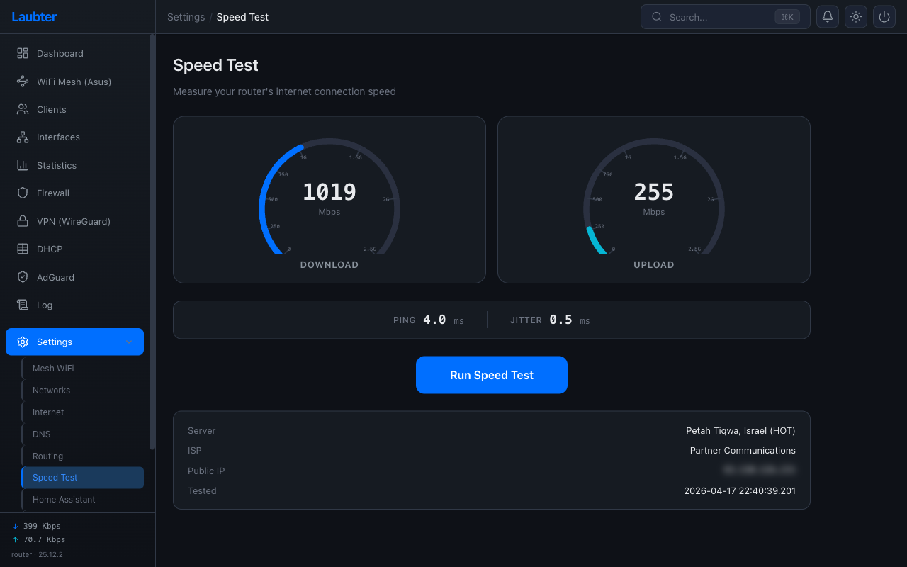

# Laubter

An opinionated web UI that ties together **OpenWrt**, **ASUS ZenWiFi mesh**, and **Home Assistant** into a single dashboard — with a curated set of self-hosted services (WireGuard VPN, AdGuard Home, DuckDNS) managed through a clean, dark-themed interface.

This is not a general-purpose OpenWrt UI. It's built for a specific stack: an OpenWrt router handling routing/firewall/DHCP, an ASUS AiMesh system handling WiFi, and Home Assistant orchestrating the smart home. Laubter is the glue that connects them and gives you one place to manage it all.



## The Stack

- **OpenWrt** — routing, firewall, DHCP, DNS, VPN
- **ASUS ZenWiFi (AiMesh)** — WiFi mesh with per-AP client tracking and topology visualization
- **Home Assistant** — room-level presence detection via MQTT, router sensor publishing
- **AdGuard Home** — DNS-level ad blocking with query log and filter management
- **WireGuard** — VPN server with QR-code peer provisioning and DuckDNS dynamic DNS

## What It Does

### Dashboard & Monitoring
- Real-time CPU, memory, temperature, bandwidth, and connection stats
- 24-hour historical charts for all metrics
- Per-client traffic monitoring with DHCP hostname resolution
- Process monitor with signal management

### ASUS AiMesh Integration
- Visual mesh topology — tree layout showing APs, backhaul type (wired/wireless), and link rates
- Per-AP client tracking with band and signal info
- Client binding to specific APs



### Home Assistant via MQTT
- Push-based integration — router publishes to MQTT, HA auto-discovers entities
- **Room-level presence** — maps each mesh AP to an HA area, so you know which room a device is in, not just "home" or "away"
- Router sensors (CPU, temp, bandwidth, VPN peers, DNS stats) appear as HA entities
- "Last area" sensor persists after disconnect — find where you left your phone


### Curated Services
- **WireGuard VPN** — one-click server setup, peer management with QR codes, DuckDNS for stable hostname
- **AdGuard Home** — dashboard, filter lists, query log, protection toggles
- **Firewall** — zones, port forwards, traffic rules, NAT, IP sets
- **DHCP** — static leases, dynamic leases, DNS records
- **Speed Test** — live gauges sampling WAN counters directly

## Screenshots

| | | |
|:-:|:-:|:-:|
|  |  |  |
|  |  |  |
|  |  |  |

See the **[User Guide](docs/guide.md)** for a walkthrough of every page, and the **[Home Assistant Integration Guide](docs/home-assistant.md)** for the full MQTT setup, presence detection, and HA dashboard examples.

## Quick Install

SSH into your OpenWrt router:

```bash
wget -O /tmp/laubter.apk https://github.com/ArielLaub/Laubter/releases/latest/download/laubter.apk
apk add --allow-untrusted /tmp/laubter.apk
rm /tmp/laubter.apk
```

Open **http://\<router-ip\>:3000**. Log in with your root password. Runs alongside LuCI on port 3000.

## Build from Source

```bash
git clone https://github.com/ArielLaub/Laubter.git
cd Laubter

# Install and build
cd frontend && npm install && cd ..
./packaging/build-apk.sh 1.0.0

# Deploy to router
scp dist/laubter_1.0.0.apk root@<router-ip>:/tmp/
ssh root@<router-ip> 'apk add --allow-untrusted /tmp/laubter_1.0.0.apk'

# Or quick dev deploy
./scripts/dev-deploy.sh <router-ip>
```

## Architecture

```
Browser ──HTTP──▶ uhttpd (:3000) ──▶ Static SPA (SvelteKit)
                       │
                       ▼
                  ubus JSON-RPC ──▶ rpcd shell plugins
                                         │
                            ┌─────────────┴──────────────┐
                            │  UCI config                 │
                            │  ASUS AiMesh API            │
                            │  AdGuard Home REST API      │
                            │  WireGuard tools            │
                            │  MQTT (mosquitto_pub)       │
                            │  DuckDNS API                │
                            └────────────────────────────┘
```

| Layer | Technology |
|-------|-----------|
| Frontend | SvelteKit 2 (Svelte 5), Tailwind CSS v4, uPlot |
| Transport | ubus JSON-RPC with automatic request batching |
| Backend | rpcd shell script plugins |
| Config | UCI (OpenWrt Unified Configuration Interface) |

## Setup

### ASUS AiMesh
In **Settings > Mesh WiFi**, enter your ASUS router IP and admin credentials. Laubter uses the ASUS app API (separate session — doesn't conflict with browser logins).

### Home Assistant
1. Install Mosquitto broker add-on in HA
2. In **Settings > Home Assistant**, enter broker address/credentials
3. Add devices to track from the DHCP client list
4. Map each mesh AP to an HA area
5. Enable — entities auto-appear in HA

### AdGuard Home
Install separately on the router, configure to listen on `127.0.0.1:3080`. Laubter provides the management UI.

### WireGuard
**Settings > VPN** — one-click server setup, add peers with QR codes, optional DuckDNS.

## Uninstall

```bash
apk del laubter
```

Removes everything. LuCI and OpenWrt config untouched.

## License

MIT
