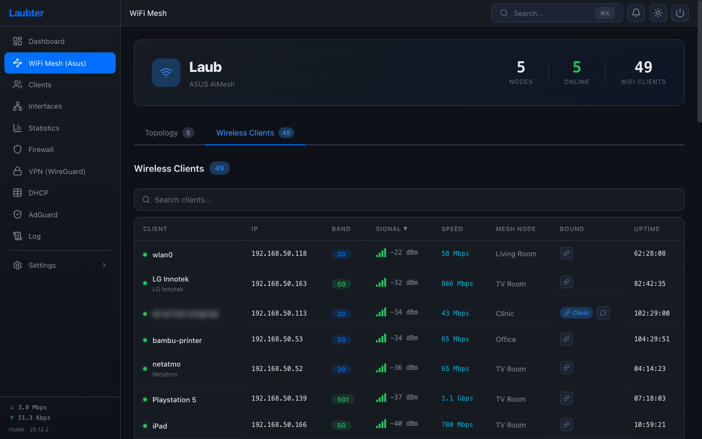
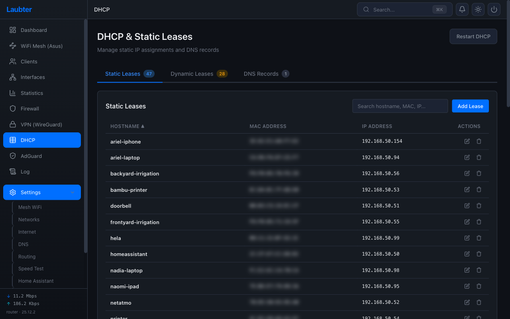
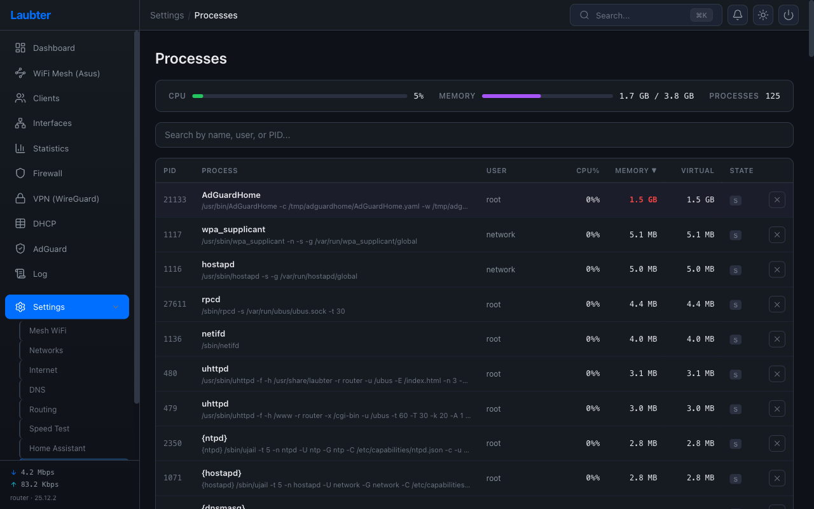

# Laubter User Guide

A page-by-page guide to using Laubter, the modern web UI for OpenWrt.

## Table of Contents

- [Dashboard](#dashboard)
- [Clients](#clients)
- [WiFi Mesh](#wifi-mesh)
- [Statistics](#statistics)
- [Firewall](#firewall)
- [VPN (WireGuard)](#vpn-wireguard)
- [DHCP](#dhcp)
- [AdGuard Home](#adguard-home)
- [Speed Test](#speed-test)
- [Home Assistant (MQTT)](#home-assistant-mqtt)
- [Processes](#processes)

---

## Dashboard

The dashboard gives you a real-time overview of your router:

- **Router** — hostname, model, uptime, kernel version, LAN IP
- **Internet** — WAN connection status, public IP (via DuckDNS), gateway, DNS servers, protocol
- **Mesh WiFi** — zone map showing which areas of your home have connected devices, with client counts per zone
- **Clients** — total connected client count with online/offline breakdown
- **Bandwidth** — live download/upload graph with current throughput, updated every 5 seconds

The sidebar shows live download/upload speeds at the bottom and provides navigation to all pages.

---

## Clients

View all devices connected to your network:

- **Search** — filter by name, IP, or MAC address
- **Columns** — hostname (from DHCP), IP address, MAC address, connection type (Ethernet/WiFi), traffic usage
- **Sorting** — click any column header to sort
- **Tabs** — switch between all clients and wireless-only view

Device names come from DHCP leases. If a device has a static lease with a hostname, that name takes priority over any name reported by the mesh system.

---

## WiFi Mesh

Visualize your ASUS AiMesh network topology:

### Topology Tab
- **Tree layout** — primary AP at the top, child nodes below
- **Colored connectors** — green = 1 Gbps+ wired backhaul, orange = 100 Mbps, red = disconnected
- **Node details** — click any AP to see its clients, IP, firmware version, and backhaul type
- **Client counts** — each node shows how many clients are connected to it

### Wireless Clients Tab

- See all WiFi clients across the mesh with their connected AP, band (2.4/5/6 GHz), and signal strength
- Click a node in the topology view to jump to its clients

### Setup
Configure your ASUS mesh in **Settings > Mesh WiFi**:
1. Enter the ASUS router IP and admin credentials
2. Laubter uses the ASUS app API, so it gets its own session without disrupting browser logins to the ASUS admin panel

---

## Statistics

Historical charts with up to 24 hours of data:

- **Summary cards** — current CPU %, temperature, memory used, active connections, peak download, daily total
- **Download / Upload** — separate bandwidth graphs with peak markers
- **CPU Usage** — percentage over time
- **Temperature** — SoC temperature in Celsius

Use the **1H / 6H / 24H** buttons to change the time range. Data is collected every 5 seconds by a background service.

---

## Firewall

Full firewall management across 6 tabs:

### General
- **Default policies** — set Input, Output, and Forward defaults (Accept/Reject/Drop)
- **Zones** — configure LAN, WAN, VPN zones with per-zone forwarding rules
- Each zone shows its interfaces, input/output/forward policies, and masquerading status

### Port Forwards
- Create DNAT rules to forward external ports to internal devices
- Device picker dropdown for easy target selection

### Traffic Rules
- Custom iptables/nftables rules with protocol, port, source/destination filtering
- Descriptions for each rule to track purpose

### NAT
- Source NAT rules beyond the default masquerading

### IP Sets
- Define IP/MAC/port sets for use in firewall rules
- Supports src_ip, dest_ip, src_mac, src_port, dest_port types

### Activity
- Live conntrack count and recent blocked connections from the firewall log

---

## VPN (WireGuard)

Set up and manage a WireGuard VPN server:

### Server Status
- **Running/Stopped** indicator with listen port, address, public key, and connected peer count
- One-click **Enable VPN Server** button for initial setup (generates keys, creates interface, configures firewall)

### Peers
- Table of all configured peers with name, IP, endpoint, last handshake, and transfer stats
- **Add Peer** — generates keys and shows a QR code you can scan with the WireGuard mobile app
- Each peer gets a unique IP from the `10.0.0.0/24` subnet

### Server Settings
- Change listen port, address range, and DNS server pushed to clients

### Dynamic DNS
- Built-in DuckDNS integration so peers can reconnect after your public IP changes
- Shows current DDNS hostname and update status

---

## DHCP

Manage DHCP leases and DNS records across 3 tabs:

### Static Leases
- Assign fixed IPs to devices by MAC address
- Set hostname, lease time, and advanced options (hostid, DUID, tag, DNS, broadcast flag)
- **Add Entry** side panel with device picker

### Dynamic Leases
- View all currently active DHCP leases from `/tmp/dhcp.leases`
- Shows expiry time, hostname, MAC, and IP

### DNS Records
- Custom DNS entries (A records) served by dnsmasq
- Useful for giving friendly names to local devices

---

## AdGuard Home

DNS-level ad blocking and filtering dashboard:

### Dashboard Tab
- **Protection status** — toggle DNS filtering on/off
- **Stats** — total queries, blocked queries, block rate percentage
- **DNS Queries / Blocked Queries** — charts over the last 24 hours
- **Top Queried Domains / Top Blocked Domains** — see what's being requested and blocked

### Filters Tab
- Manage blocklists (add/remove filter list URLs)
- Custom user rules for manual block/allow entries
- Toggle safe browsing and parental controls

### Query Log Tab
- Real-time searchable log of all DNS queries
- Shows client, domain, response type (allowed/blocked), and response time
- Configurable retention period (default 24 hours)

### Setup
AdGuard Home runs on the router at `127.0.0.1:3080`. It must be installed separately — Laubter provides the management UI.

---

## Speed Test

Test your internet connection speed:

- **SVG arc gauges** — live download and upload speed display (up to 2.5 Gbps scale)
- **Real-time measurement** — during the test, Laubter samples WAN interface counters directly for accurate live readings
- **Results** — download speed, upload speed, ping, and jitter
- **History** — previous test results stored for comparison

Click **Run Speed Test** to start. The test runs `speedtest-go` on the router.

---

## Home Assistant (MQTT)

Publish router data to Home Assistant via MQTT auto-discovery:

### MQTT Connection
- Configure broker address, port, username/password, topic prefix, and update interval
- **Test Connection** to verify broker connectivity
- Enable/disable the integration with a toggle

### Tracked Devices (Presence Detection)
- Add devices to track by selecting from your DHCP client list
- Each tracked device gets a `device_tracker` entity in HA
- Device name auto-fills from DHCP hostname

### AP to Area Mapping
- Map each mesh access point to a Home Assistant area
- Areas are fetched from HA via a Long-Lived Access Token
- When a tracked device connects to an AP, its location updates to the mapped area
- A "Last Area" sensor persists the location after the device disconnects (useful for "where did I leave my phone?")

### What Appears in HA
- **Device trackers** — one per tracked device, state is the area ID (for automations) or home/not_home
- **Last area sensors** — friendly area name that persists after disconnect
- **Router sensors** — CPU, memory, temperature, download/upload speed, connections, clients, VPN peers, DNS queries, DNS blocked
- All grouped under a single "Laubter Router" device

For the full integration guide — setup, presence detection logic, HA dashboard examples, troubleshooting, and MQTT topic reference — see **[Home Assistant Integration](home-assistant.md)**.

---

## Processes

Monitor and manage running processes:

- **CPU / Memory bars** — system-wide usage at the top
- **Process table** — PID, name, user, CPU %, memory %, virtual memory, state
- **Search** — filter by process name, user, or PID
- **Sort** — click any column header
- **Kill** — select a process and send a signal (SIGTERM, SIGKILL, SIGHUP, SIGINT)

The process list refreshes every 5 seconds.
