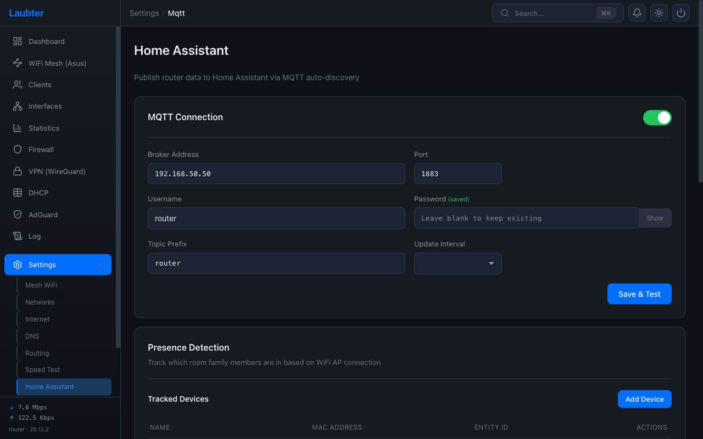

# Home Assistant Integration

Laubter pushes router data to Home Assistant via MQTT auto-discovery. No HA-side configuration needed — entities appear automatically.

This replaces the standard OpenWrt HA integration (which requires sharing router credentials and only gives flat home/not_home detection). Laubter's approach is push-based, credential-free on the HA side, and supports room-level presence.

## How It Works

```
Laubter (OpenWrt) ──mosquitto_pub──▶ MQTT Broker (Mosquitto on HA)
                                           │
                                     Home Assistant
                                     ├── device_tracker.ariel_phone → "office"
                                     ├── sensor.ariel_phone_last_area → "Office"
                                     ├── sensor.laubter_cpu → 6%
                                     ├── sensor.laubter_memory → 42%
                                     ├── sensor.laubter_temperature → 47°C
                                     └── ...
```

The router publishes data every 10 seconds (configurable). HA discovers entities via MQTT discovery topics. All entities are grouped under a single **"Laubter Router"** device in HA.

## Setup

### 1. Install Mosquitto on Home Assistant

In HA, go to **Settings > Add-ons > Add-on Store** and install **Mosquitto broker**. Start it. That's it — MQTT integration auto-configures.

### 2. Configure Laubter

In Laubter, go to **Settings > Home Assistant**:



1. **Enable** the integration toggle
2. Enter your **broker address** (your HA IP, e.g. `192.168.50.50`)
3. Enter **port** (default `1883`)
4. Enter **username/password** if your Mosquitto broker requires auth
5. Set **topic prefix** (default `laubter`) — all MQTT topics start with this
6. Set **update interval** (default 10 seconds)
7. Click **Test Connection** to verify

### 3. Add Devices to Track

Under **Presence Detection > Tracked Devices**:

1. Click **Add Device**
2. Select a device from the dropdown (shows all DHCP clients with hostname and MAC)
3. The **Name** auto-fills from the DHCP hostname
4. The **Entity ID** auto-generates from the name (e.g. "Ariel's Phone" → `ariels_phone`)
5. Save

Repeat for each device you want to track (phones, laptops, etc.).

### 4. Set Up a Home Assistant Token

To fetch your HA areas for the zone mapping dropdown:

1. In Home Assistant, go to your **Profile** (click your avatar, bottom-left)
2. Scroll to **Long-Lived Access Tokens** and create one
3. Paste it into the **HA Long-Lived Access Token** field in Laubter
4. Your HA areas will load in the AP mapping dropdown

### 5. Map APs to Areas

Under **AP to Area Mapping**, each mesh access point is listed. For each AP:

1. Select the HA area it covers from the dropdown (e.g. Office AP → "Office")
2. Click **Save**

This is what enables room-level presence. When a phone connects to the Office AP, its device tracker state becomes `office` instead of just `home`.

## What Appears in Home Assistant

### Device Trackers

One `device_tracker` entity per tracked device:

| Entity | State | Example |
|--------|-------|---------|
| `device_tracker.laubter_ariels_phone` | Area ID when home, `not_home` when away | `office`, `living_room`, `not_home` |

The state is the **area ID** (lowercase, underscored) — stable for automations. Values match what you configured in the AP-to-area mapping.

Use these for automations:
```yaml
trigger:
  - platform: state
    entity_id: device_tracker.laubter_ariels_phone
    to: "office"
action:
  - service: light.turn_on
    target:
      entity_id: light.office_desk
```

### Last Area Sensors

One sensor per tracked device showing the **friendly area name**:

| Entity | State | Purpose |
|--------|-------|---------|
| `sensor.laubter_ariels_phone_last_area` | "Office", "Living Room", etc. | Dashboard display |

This sensor uses a **retained** MQTT message — it keeps its value even after the device disconnects. Useful for "where did I leave my phone?" dashboards.

The difference:
- **device_tracker** → `not_home` when device disconnects (for automations)
- **last_area sensor** → stays at "Office" after disconnect (for display)

### Router Sensors

| Entity | Value | Unit |
|--------|-------|------|
| `sensor.laubter_cpu` | CPU usage | % |
| `sensor.laubter_memory` | Memory usage | % |
| `sensor.laubter_temperature` | SoC temperature | °C |
| `sensor.laubter_download` | Current download speed | Mbps |
| `sensor.laubter_upload` | Current upload speed | Mbps |
| `sensor.laubter_connections` | Active network connections | |
| `sensor.laubter_clients` | Connected DHCP clients | |
| `sensor.laubter_vpn_peers` | VPN peers (online/total) | |
| `sensor.laubter_dns_queries` | AdGuard DNS queries (24h) | |
| `sensor.laubter_dns_blocked` | AdGuard blocked queries (24h) | |

All sensors are grouped under the **"Laubter Router"** device in HA, making them easy to find and add to dashboards.

## Presence Detection Deep Dive

### How Zone Detection Works

```
Phone connects to WiFi
        │
        ▼
ASUS AiMesh tracks which AP it's on
        │
        ▼
Laubter reads mesh client list (every 10s)
        │
        ▼
Finds phone → connected to AP with MAC F0:2F:74:12:8C:B0
        │
        ▼
Looks up AP MAC in zone mapping → "office"
        │
        ▼
Publishes: laubter/presence/ariels_phone → "office"
           laubter/presence/ariels_phone/last_area → "Office" (retained)
```

### Detection States

| Scenario | device_tracker state | last_area sensor |
|----------|---------------------|------------------|
| Connected to mapped AP | Area ID (e.g. `office`) | Friendly name (e.g. "Office") |
| Connected to unmapped AP | `home` | Unchanged (keeps last known) |
| Found in DHCP leases but not mesh | `home` | Unchanged |
| Not found anywhere | `not_home` | Unchanged |

### Fallback Logic

1. **Mesh client list** — primary source. Checks ASUS AiMesh `allclientlist` for the device MAC
2. **DHCP leases** — fallback. If the device isn't in the mesh client list but has an active DHCP lease, it's considered `home` (covers wired devices and edge cases)

## Example HA Dashboard

Create a simple "Who's Where" dashboard card:

```yaml
type: entities
title: Family Location
entities:
  - entity: sensor.laubter_ariels_phone_last_area
    name: Ariel
    icon: mdi:cellphone
  - entity: sensor.laubter_gurys_laptop_last_area
    name: Gury
    icon: mdi:laptop
```

Or a router status card:

```yaml
type: glance
title: Router
entities:
  - entity: sensor.laubter_cpu
  - entity: sensor.laubter_memory
  - entity: sensor.laubter_temperature
  - entity: sensor.laubter_clients
  - entity: sensor.laubter_vpn_peers
```

## Troubleshooting

### Entities don't appear in HA
- Check that the Mosquitto add-on is running
- Verify the MQTT broker address and credentials in Laubter
- Click **Test Connection** — it should show "Connected"
- Click **Re-publish Discovery** to force HA to re-discover entities
- Check HA's MQTT integration page for discovered devices

### Presence stuck on "not_home"
- Verify the device MAC is correct (check DHCP leases)
- Make sure the ASUS mesh is configured and accessible in **Settings > Mesh WiFi**
- The mesh client list only updates when the ASUS API is reachable

### Zones not working (always "home")
- Check that APs are mapped to areas in the **AP to Area Mapping** section
- Verify the AP MAC addresses match what the mesh reports
- Unmapped APs default to `home`

## MQTT Topics Reference

All topics use the configured prefix (default `laubter`):

| Topic | Payload | Retained |
|-------|---------|----------|
| `laubter/presence/{entity_id}` | Area ID, `home`, or `not_home` | No |
| `laubter/presence/{entity_id}/last_area` | Friendly area name | Yes |
| `laubter/sensor/cpu` | CPU % | No |
| `laubter/sensor/memory` | Memory % | No |
| `laubter/sensor/temperature` | Temperature °C | No |
| `laubter/sensor/download` | Download Mbps | No |
| `laubter/sensor/upload` | Upload Mbps | No |
| `laubter/sensor/connections` | Connection count | No |
| `laubter/sensor/clients` | Client count | No |
| `laubter/sensor/vpn_peers` | "online/total" | No |
| `laubter/sensor/dns_queries` | Query count (24h) | No |
| `laubter/sensor/dns_blocked` | Blocked count (24h) | No |
| `homeassistant/sensor/laubter_*/config` | Discovery payload | Yes |
| `homeassistant/device_tracker/laubter_*/config` | Discovery payload | Yes |
